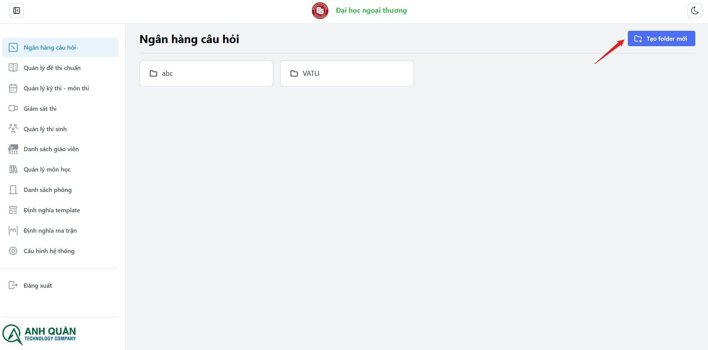
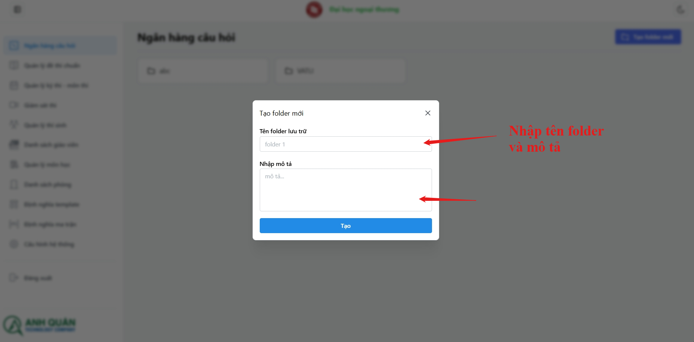
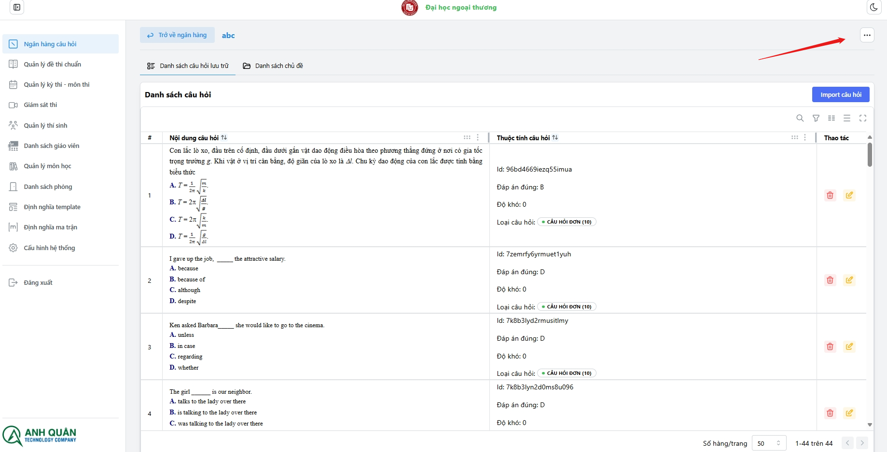
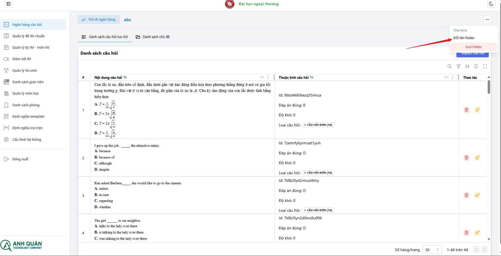
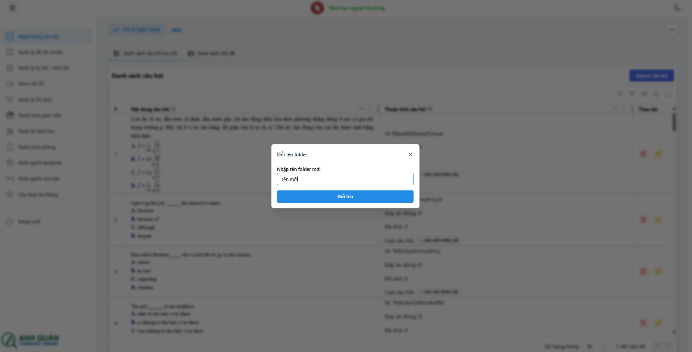
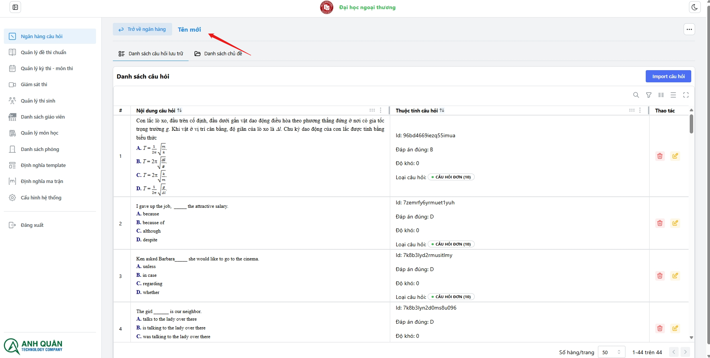
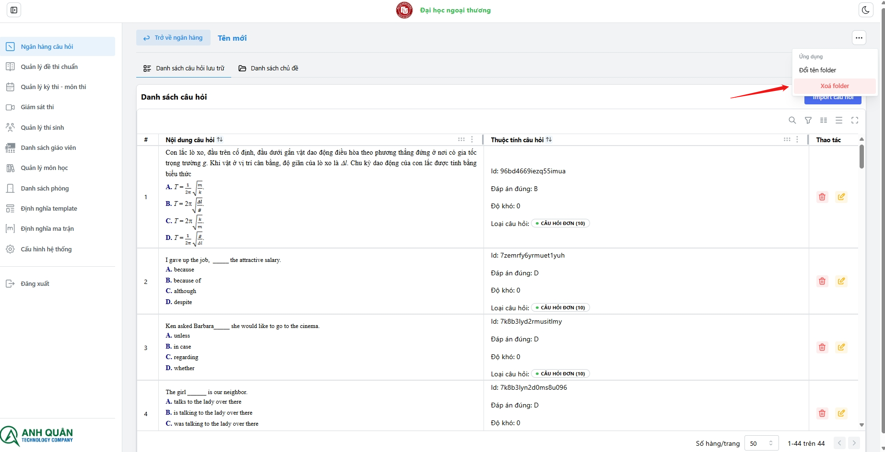
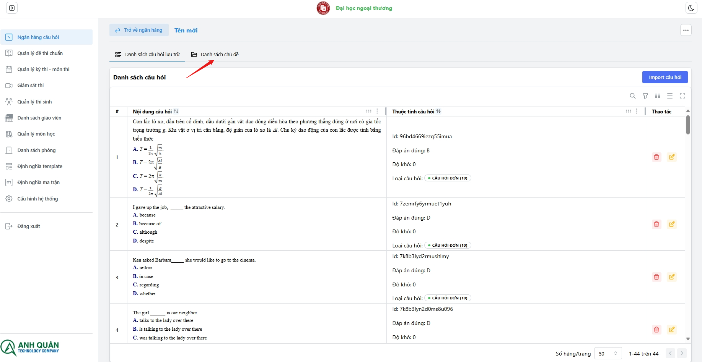
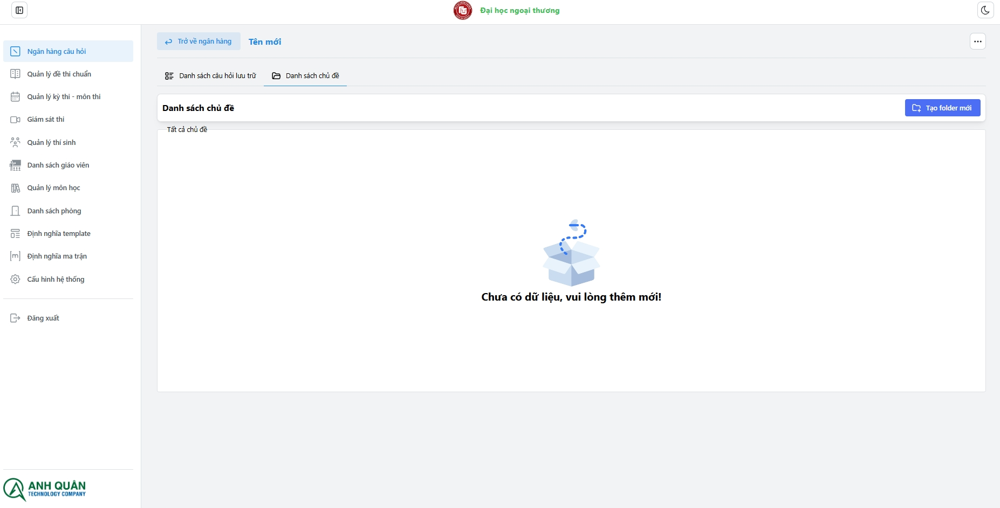

# Quản lí folder

**_Danh sách chức năng:_**

1. Xem danh sách folder
1. Tạo folder
1. Đổi tên folder
1. Xóa folder
1. Xem danh sách folder (chủ đề) trong folder

## Tạo folder

_Folder dùng để lưu trữ các câu hỏi, bạn có thể phân cấp folder thành các đơn vị kiến thức như chương 1, chương 2, Khó, Dễ, Trung bình để hỗ trợ sử dụng ma trận sau này_

:::tip[My tip]
Bạn có thể nhấn phím **Enter** để tạo nhanh
:::

## Đổi tên folder

1. chọn nút options
   
1. Nhấp vào đổi tên menu
   
1. Nhập tên folder cần đổi:
   
1. Tên đã được cập nhật:
   

## Xóa folder

## Xem danh sách folder (chủ đề) trong folder

