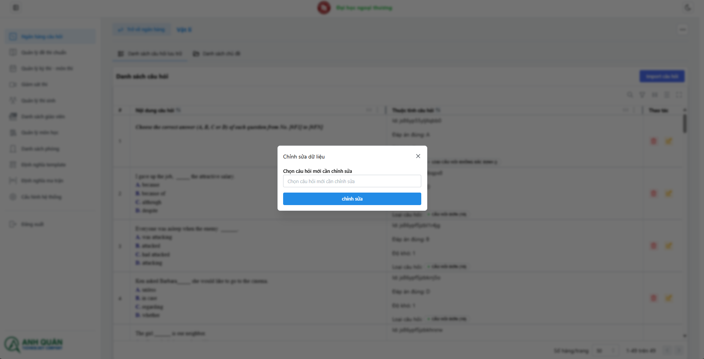

# Quản lí câu hỏi

**_Danh sách chức năng:_**

1. Import câu hỏi
1. Xem danh sách câu hỏi trong folder
1. Sửa câu hỏi
1. Xóa câu hỏi

## Import câu hỏi

1. Bấm vào import câu hỏi
   
1. Chọn file cần import từ máy:
   
   
   

   :::warning[Hiệu suất]
   Thao tác có thể mất từ 10-20s
   :::

## Sửa câu hỏi

1. Chọn câu hỏi cần chỉnh sửa
   
1. Bạn chi cần chọn file word cần chỉnh sửa
   

   :::tip[Nghiệp vụ]
   Chương trình sẽ lấy câu hỏi đầu tiên của file word để update
   :::

## Xóa câu hỏi

Khi nhấp vào sẽ tự động xóa câu hỏi

