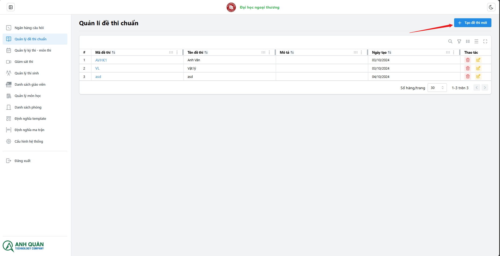

# Quản lí đề thi

**_Danh sách chức năng:_**

1. Tạo đề thi
1. Xóa đề thi
1. Sửa đề thi

## 1. Tạo đề thi

1. Nhấp vào nút tạo đề thi
   
1. Hệ thống sẽ chuyển bạn tới trang form tạo đề thi, vui lòng điền các thông tin cơ bản
   
   #### Trong đó (\* là bắt buộc):
   - **_\*Mã đề thi (Ký tự):_** Mã của đề thi, trường cần quy chuẩn chung 1 quy tắc để thuận tiện quản lý, VD: 2023-CNTN-HK1-001
   - **_\*Tên đề thi (Ký tự):_** Tên của đề thi, đặt để sinh viên hoặc giáo viên nhìn vào dễ nhận biết, VD: Đề thi chuẩn vật lí HK223
   - **_\*Môn học (Ký tự):_** Sẽ có gợi ý chọn môn học bạn có thể sử dụng các gợi ý hoặc tự gõ
   - **_\*Số lượng câu hỏi (Số):_** Số lượng câu hỏi của đề, VD: 10
   - **_Mô tả (ký tự):_** Mô tả cho đề thi, VD: Đề thi này sử dụng cho thi kết thúc học phần môn vật lý HK223
     :::warning
     Chỉ khi số lượng câu hỏi và tổng số điểm lớn hơn 0 mới hiển thị chức năng thêm phần thi
     :::
1. Thêm phần thi
   
   Chọn thêm phần thi
   

   
   Thêm tổng cộng 2 phần thi
   

1. Chọn câu hỏi vào phần thi:

   **Có nhiều cách để import câu hỏi vào phần thi:**

   ### _1. Chọn câu hỏi thủ công_:

   

   
   Chọn các câu hỏi muốn thêm
   
   Các câu hỏi đã được thêm vào phần 1:
   

   ### _2. Chọn câu hỏi theo ma trận_

   :::danger
   Vẫn còn một số lỗi nhỏ, đang phát triển...
   :::

   ### _3. Import câu hỏi_

   
   Chọn file word cần import
   
   _Hệ thống sẽ lấy toàn bộ câu hỏi trong file đưa vào phần thi đó._

1. Nhấn tạo đề thi
   

## 2. Xóa đề thi

## 3. Sửa đề thi

