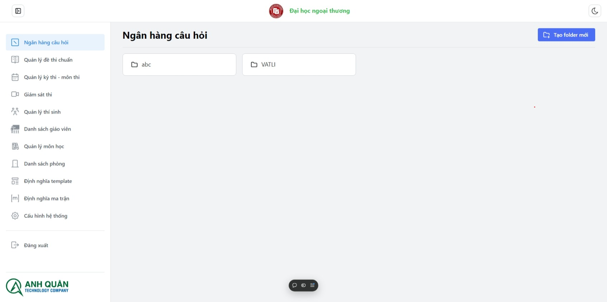
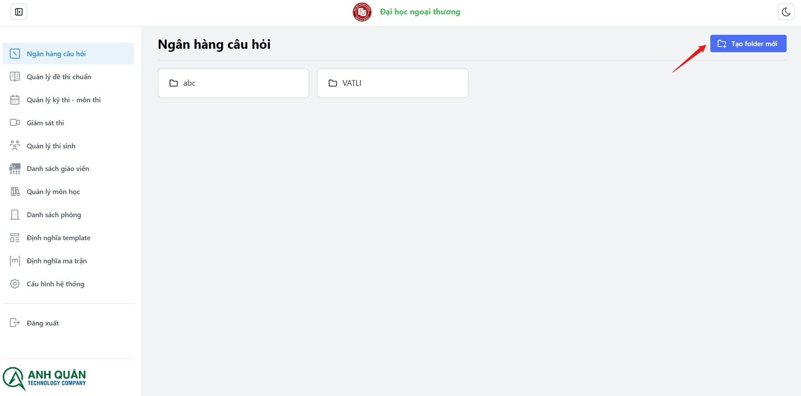
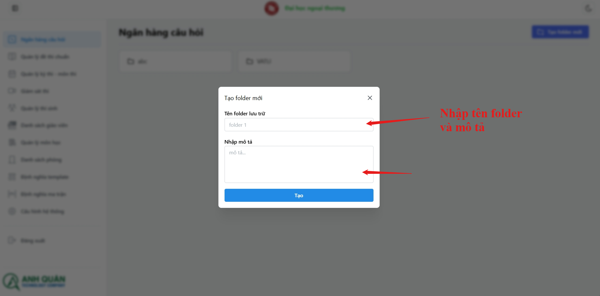

# Module - Ngân hàng câu hỏi

Các chức năng của **Module - Ngân hàng câu hỏi**:

**_Quản lí folder:_**

1. Xem danh sách folder
1. Tạo folder
1. Đổi tên folder
1. Xóa folder
1. Xem danh sách folder (chủ đề) trong folder

**_Quản lí câu hỏi:_**

1. Import câu hỏi
1. Xem danh sách câu hỏi trong folder
1. Sửa câu hỏi
1. Xóa câu hỏi

## Quản lí folder

### Tạo folder

_Folder dùng để lưu trữ các câu hỏi, bạn có thể phân cấp folder thành các đơn vị kiến thức như chương 1, chương 2, Khó, Dễ, Trung bình để hỗ trợ sử dụng ma trận sau này_

:::tip[My tip]

Bạn có thể nhấn phím **Enter** để tạo nhanh

:::
