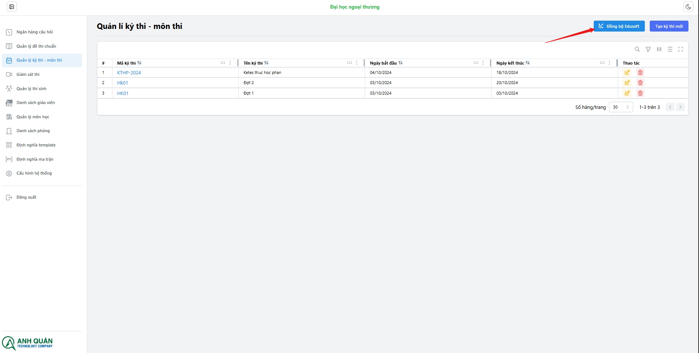

# Tổng quan

Đây là nơi tổ chức và quản lí các kỳ thi, môn thi (Có thể sử dụng là ca thi). Đồng bộ Edusoft, import các kỳ thi, môn thi từ Edusoft lên hệ thống và trả điểm về.

:::tip
Bạn có thể sẽ không cần phải tự tạo các ký thi, môn thi. Thay vào đó bạn có thể sử dụng chức năng đồng bộ:

:::

Các chức năng của **Module - Kỳ thi / Môn thi**:

**_Quản lí kỳ thi:_**

1. Tạo kỳ thi
1. Xóa kỳ thi
1. Sửa kỳ thi

**_Quản lí môn thi:_**

1. Tạo môn thi
1. Xóa môn thi
1. Sửa môn thi
1. Thay đổi đề thi
1. Xem / Xuất bản điểm
