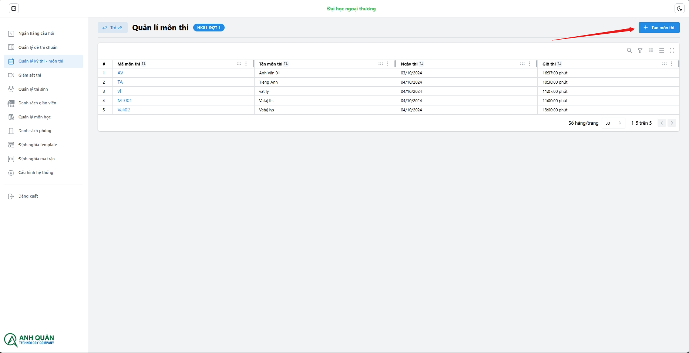
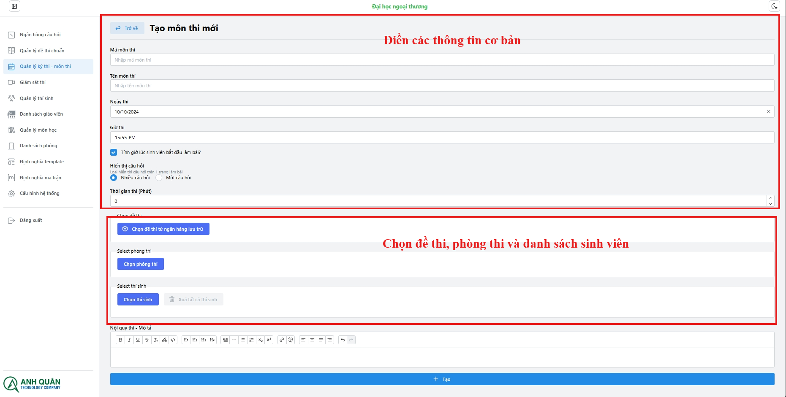
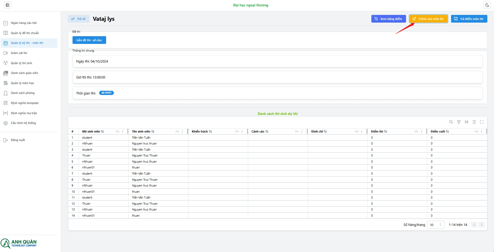
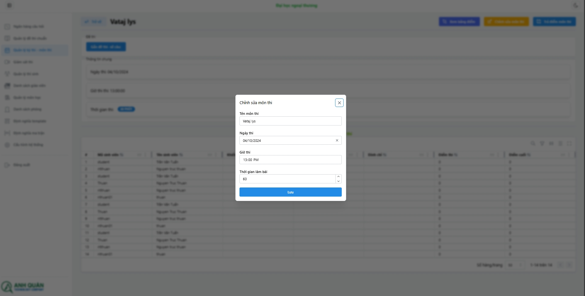
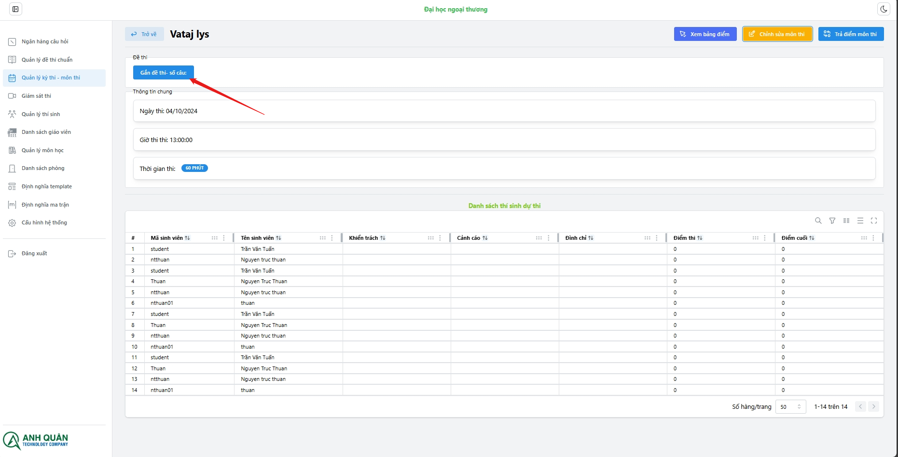
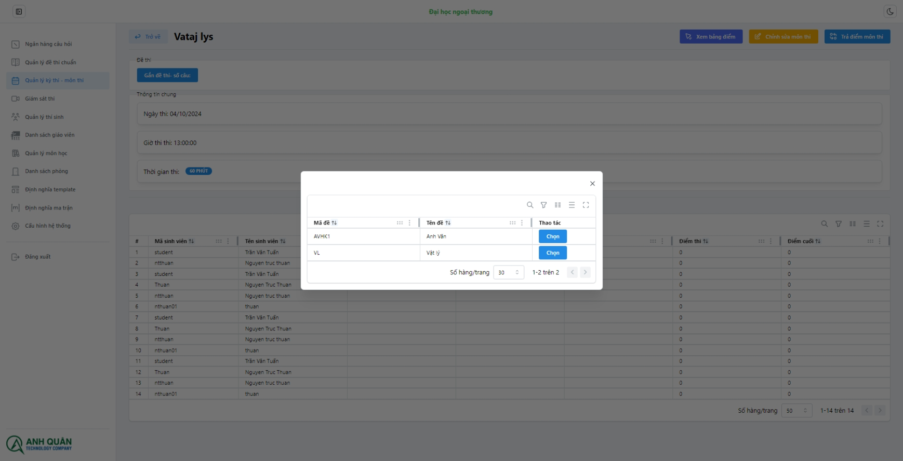
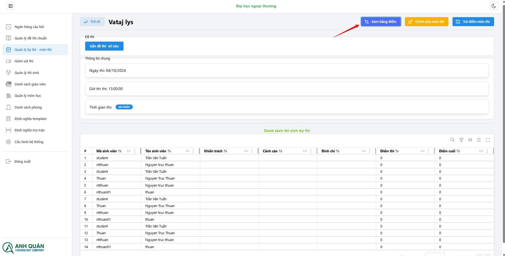
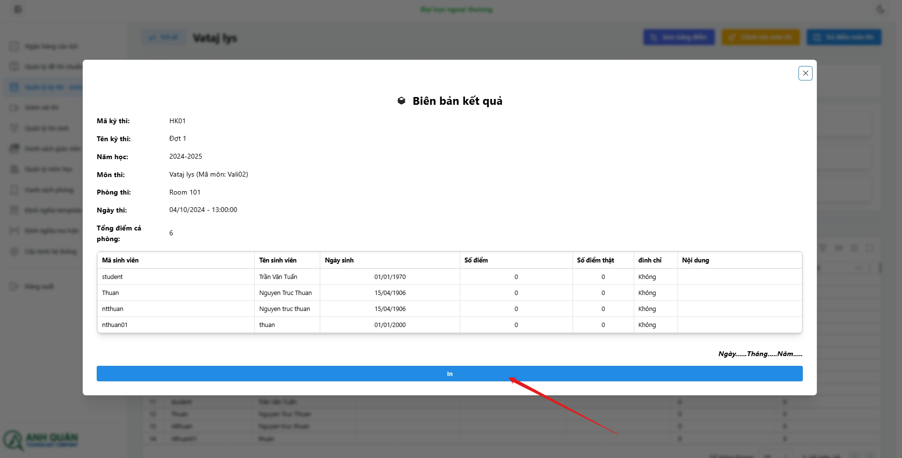
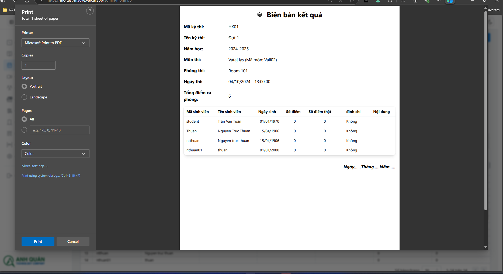
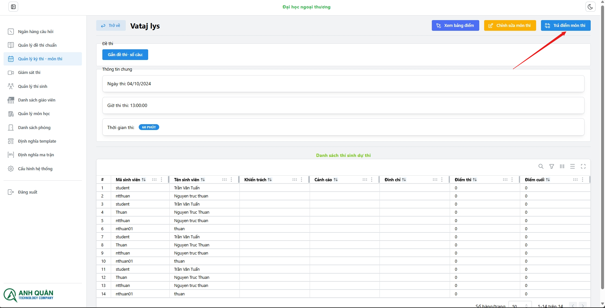

# Quản lí môn thi

Các chức năng của **Module - Môn thi**:

1. Tạo môn thi
1. Xóa môn thi
1. Sửa môn thi
1. Thay đổi đề thi
1. Xem / Xuất bản điểm
1. Trả điểm môn thi

## 1. Tạo môn thi

1. Chọn kỳ thi sao đó chọn môn thi
   

   

## 2. Xóa môn thi

## 3. Sửa môn thi

1. Vào trong môn thi cần sửa
   
   :::tip
   Bạn có thể update lại môn thi sao khi đã đồng bộ
   
   :::

## 4. Thay đổi đề thi

Tìm và chọn đề thi cần thay đổi:

## 5. Xem / Xuất bảng điểm

In bảng điểm:

## 6. Trả điểm môn thi

_Trả điểm môn thi này về Edusoft._
