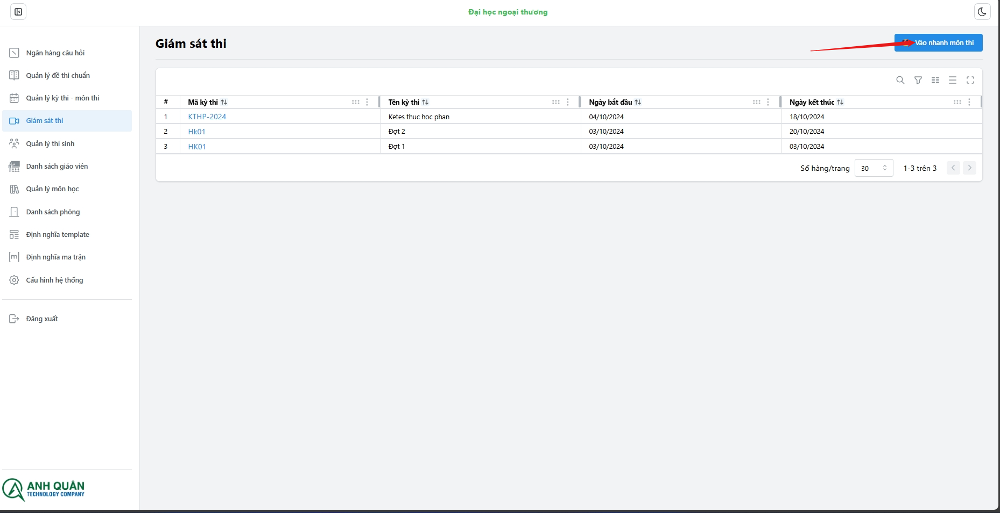
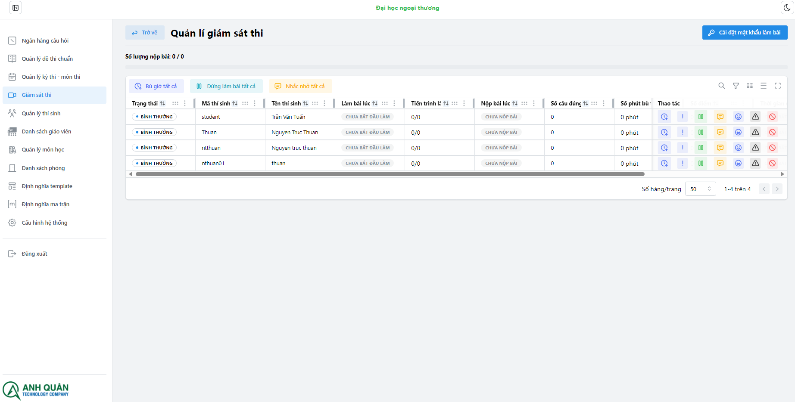

# Quản lí giám sát

Các chức năng của **Module - Giám sát**:

1. Vào nhanh môn thi.
1. Cài đặt mật khẩu phòng thi.
1. Bù giờ cho sinh viên.
1. Xem lịch sử hoạt động trình duyệt.
1. Dừng làm bài.
1. Nhắc nhở sinh viên.
1. Khiển trách sinh viên (-25% điểm).
1. Cảnh cáo sinh viên (-50% điểm).
1. Đình chỉ sinh viên (-100% điểm).

Các chức năng áp dụng tất cả sinh viên:

1. Bù giờ tất cả.
1. Dừng làm bài tất cả.
1. Nhắc nhở tất cả.

## 1. Vào nhanh môn thi

Chỉ cần nhập mã môn thi hệ thống sẽ tự động điều hướng bạn tới trang giam sát ca thi:

## 2. Cài đặt mật khẩu phòng thi
