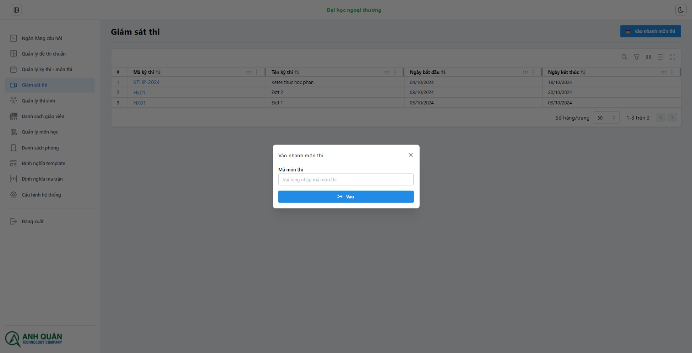

# Quản lí giám sát

Các chức năng của **Module - Giám sát**:

1. Vào nhanh môn thi.
1. Cài đặt mật khẩu phòng thi.
1. Bù giờ cho sinh viên.
1. Xem lịch sử hoạt động trình duyệt.
1. Dừng làm bài.
1. Nhắc nhở sinh viên.
1. Khiển trách sinh viên (-25% điểm).
1. Cảnh cáo sinh viên (-50% điểm).
1. Đình chỉ sinh viên (-100% điểm).

Các chức năng áp dụng tất cả sinh viên:

1. Bù giờ tất cả.
1. Dừng làm bài tất cả.
1. Nhắc nhở tất cả.

## 1. Vào nhanh môn thi

Chỉ cần nhập mã môn thi hệ thống sẽ tự động điều hướng bạn tới trang giam sát ca thi:

## 2. Cài đặt mật khẩu phòng thi

_Bạn có thể tự nhập mã phòng thi hoặc tạo tự đồng từ nút options._

Mã đã tự tạo

Sau đó bấm nút Tạo/Sửa để cài mật khẩu khi sinh viên muốn làm bài thi này.

## 3. Bù giờ cho sinh viên

Chọn theo sinh viên cần bù giờ

Nhập số phút cần bù và nhấn vào thêm thời gian làm bài:

:::tip
Số phút sẽ được cộng vào số phút hiện tại của sinh viên lúc đang hoặc trước khi làm bài
:::

## 4. Xem lịch sử hoạt động trình duyệt

:::tip
Chương trình sẽ hiện thị danh sách số lần sinh viên vào trang làm bài (thời gian vào, địa chỉ IP vào) bao gồm refresh lại trang, tắt trình duyệt vào lại....
:::

## 5. Dừng làm bài

Nhập lí do dừng làm bài:

Bạn có thể bỏ dừng làm bài:

## 6. Nhắc nhở sinh viên

Có thể nhập trực tiếp hoặc chọn template

## 7. Khiển trách sinh viên

:::warning
Sinh viên đã bị khiển trách sẽ bì trừ 25% tổng số điểm.
:::

## 8. Cảnh cáo sinh viên

:::warning
Sinh viên đã bị cảnh cáo sẽ bì trừ 50% tổng số điểm.
:::

## 9. Đình chỉ sinh viên

- Chọn các lý do đình chỉ

  

- Có thể nhập nội dung mô tả từ tempalte
  :::danger
  Sinh viên đã bị đình chỉ sẽ nhận điểm cuối là 0 điểm!
  :::
