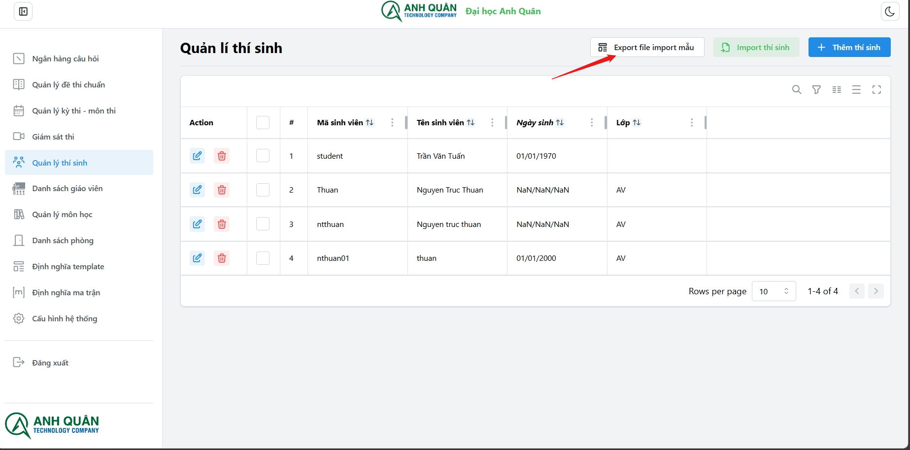
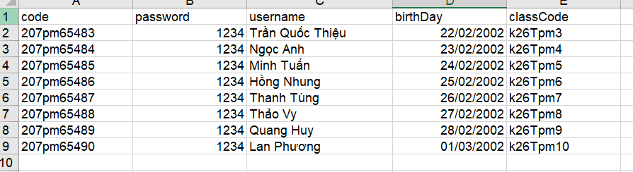
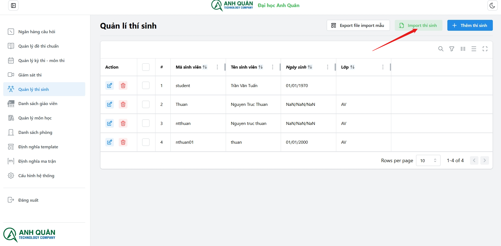
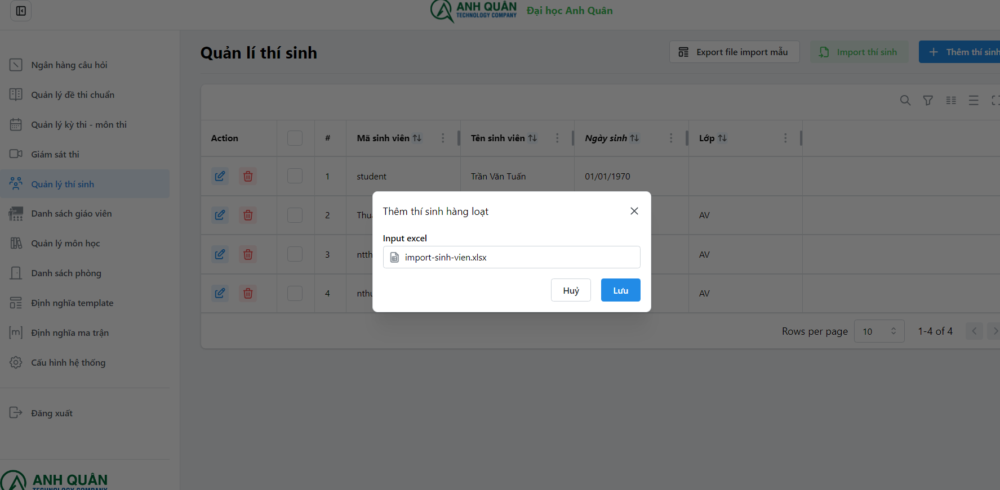
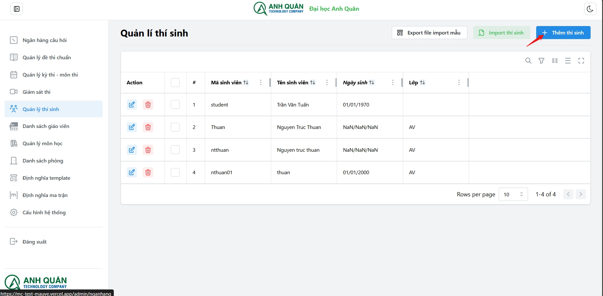
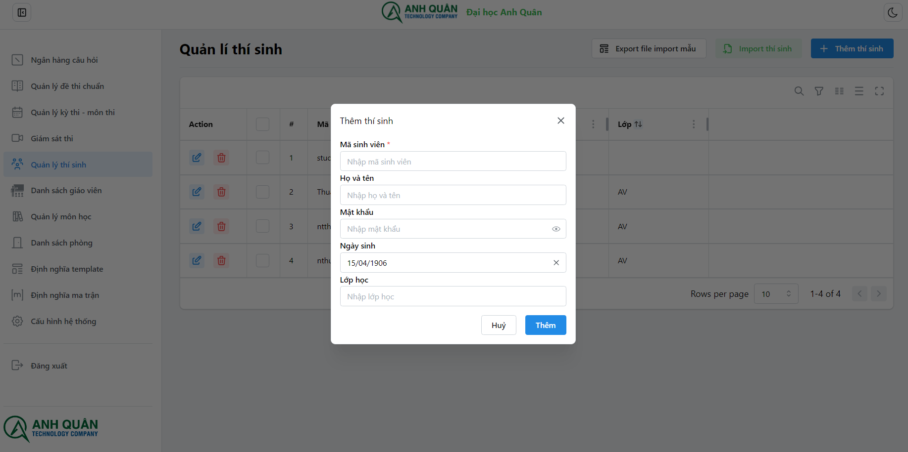

# Quản lí thí sinh

Các chức năng của **Module - Quản lí thí sinh**:

1. Export file import mẫu
1. Import thí sinh
1. Thêm thí sinh
1. Sửa thí sinh
1. Xóa thí sinh

## 1. Export file import mẫu

Hệ thống sẽ tự tải về máy file excel với nội dung sau:

:::tip
Vui lòng sửa dữ liệu, hoặc tạo các cột theo đúng format để chuẩn bị import.
:::

## 2. Import thí sinh

Chọn file cần import

## 3. Thêm thí sinh

