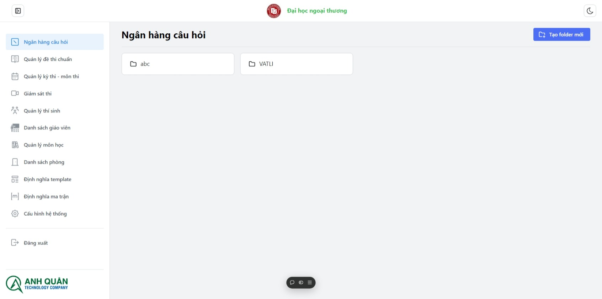
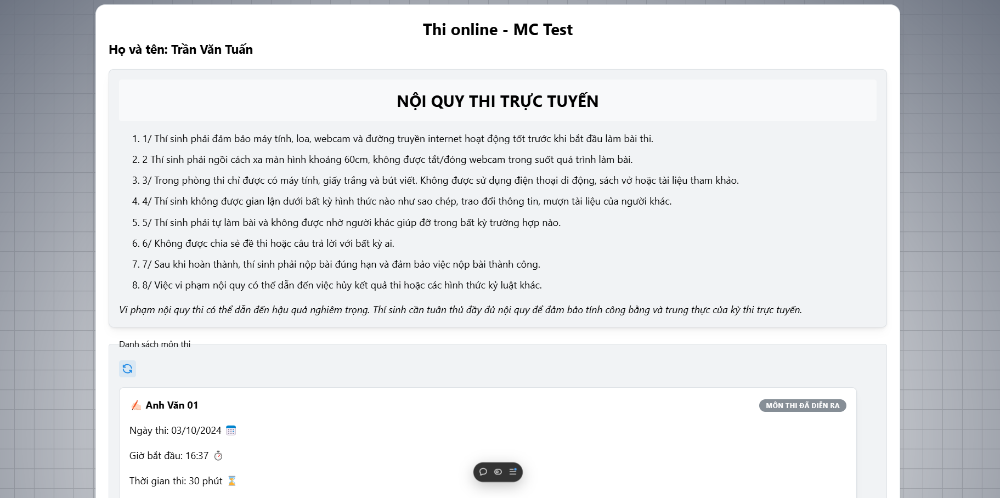

# Giới thiệu tổng quan

AQ-EduMCTest được phát triển bởi công ty công nghệ Anh Quân, hỗ trợ việc thi online và quản lí ngân hàng câu hỏi. Website lấy cảm hứng và được phát triển lại từ MC Bank và MC Test online.

Chúng tôi hi vọng có thể cung cấp được cho khách hàng các website có được các giao diện thân thiện dễ sử dụng và các tính năng thú vị.

Hãy khám phá **AQ-EduMCTest in trong vòng chưa đầy 5 phút**.

### Những gì bạn cần

Tải hoặc sử dụng các trình duyệt phổ biến để đạt được trải nghiệm tốt nhất khi sử dụng:

- [Edge Browser](https://www.microsoft.com/en-us/edge/download)
- [Google Chrome](https://www.google.com/chrome/what-you-make-of-it/)

## Bắt đầu

Truy cập vào website của chúng tôi: **[https://mc-test-mauve.vercel.app/](https://mc-test-mauve.vercel.app/)** (Đây là môi trường thử nghiệm - Beta)

Theo nghiệp vụ hiện tại hệ thống có 3 vai trò sử dụng:

- Quản trị viên
- Giáo viên
- Học sinh

**_Website chi có 1 trang đăng nhập duy nhất cho tất cả quyền:_**

- Quản trị viên, Giáo viên sẽ được vào trang quản lí hệ thống
  
- Học sinh sau khi đăng nhập sẽ vào trang chuẩn bị làm bài
  
